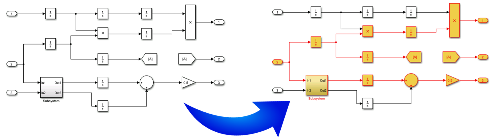

# Reach/Coreach Tool

Tracks and highlights data flow and control flow in a Simulink model. The tool identifies, for some specified Simulink blocks, parts of the model that depend on those blocks (Reach functionality), or parts of the model that the specified blocks depend upon (Coreach functionality). After the dependencies have been identified, the extraneous blocks can be removed via the tool's model slicing function.

## User Guide

For installation and other information, please see the [User Guide](doc/ReachCoreach_UserGuide.pdf).

## Related Publications

Vera Pantelic, Steven Postma, Mark Lawford, Monika Jaskolka, Bennett Mackenzie, Alexandre Korobkine, Marc Bender, Jeff Ong, Gordon Marks, Alan Wassyng, [“Software engineering practices and Simulink: bridging the gap,”](https://link.springer.com/article/10.1007/s10009-017-0450-9) International Journal on Software Tools for Technology Transfer (STTT), 2017, 1-23.

Vera Pantelic, Steven Postma, Mark Lawford, Alexandre Korobkine, Bennett Mackenzie, Jeff Ong, Marc Bender, ["A Toolset for Simulink: Improving Software Engineering Practices in Development with Simulink,"](https://ieeexplore.ieee.org/document/7323083/) Proceedings of 3rd International Conference on Model-Driven Engineering and Software Development (MODELSWARD 2015), SCITEPRESS, 2015, 50-61. (Best Paper Award)

## Matlab Central
This tool is also available on the [Matlab Central File Exchange](https://www.mathworks.com/matlabcentral/fileexchange/51180-reach-coreach-tool).

